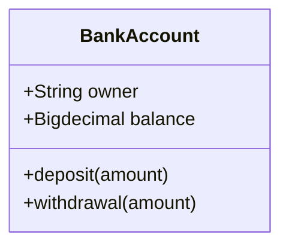

# a1lab.github.io


```java
public static void main(String[] args) {
	int valor;
	Classes classes = new Classes();
	System.out.println(classes.teste);
	System.out.println(classes.caractereZero);

	Classes primeiraClasse = new Classes(); // a parte direita da declaração cria um objeto
	// a esquerda referencia à variável primeiraClasse, do tipo Classes
	primeiraClasse.teste = true;
	Classes segundaClasse = primeiraClasse;
	// ao fazer isso, a variável segundaClasse aponta para o mesmo objeto de
	// declaração acima
	// toda alteração em uma variável afeta a outra
	primeiraClasse.teste = false;
	System.out.println(segundaClasse.teste + " deve ser false");
	segundaClasse.teste = true;
	System.out.println(primeiraClasse.teste + " deve ser true");

	}
```


```topojson
{
  "type": "Topology",
  "transform": {
    "scale": [0.0005000500050005, 0.00010001000100010001],
    "translate": [100, 0]
  },
  "objects": {
    "example": {
      "type": "GeometryCollection",
      "geometries": [
        {
          "type": "Point",
          "properties": {"prop0": "value0"},
          "coordinates": [4000, 5000]
        },
        {
          "type": "LineString",
          "properties": {"prop0": "value0", "prop1": 0},
          "arcs": [0]
        },
        {
          "type": "Polygon",
          "properties": {"prop0": "value0",
            "prop1": {"this": "that"}
          },
          "arcs": [[1]]
        }
      ]
    }
  },
  "arcs": [[[4000, 0], [1999, 9999], [2000, -9999], [2000, 9999]],[[0, 0], [0, 9999], [2000, 0], [0, -9999], [-2000, 0]]]
}
```
