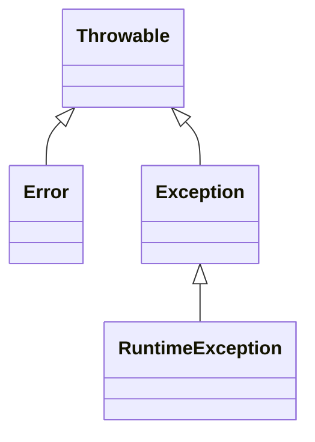

# Call stack

* No eclipse é possível executar a aplicação linha por linha, clicando na opção step-over
* Ao executar uma linha de código, tudo o que está contido dentro dela será executado

```java
public class Fluxo {

	public static void main(String[] args) {
		System.out.println("inicio do main"); // break point
		metodo1();
		System.out.println("fim do main");
	}

	public static void metodo1() {
		System.out.println("inicio do metodo1");
		metodo2();
		System.out.println("fim do metodo1");
	}

	public static void metodo2() {
		System.out.println("inicio do metodo2");
		for (int i = 1; i <= 5; i++) {
			System.out.println(i);
		}
		System.out.println("fim do metodo2");
	}

}

```

* No exemplo acima, antes do _break point_, a saído do console será:

> inicio do main

* Ainda no exemplo acima, ao executar um _step over_, todas as instruções do **metodo1()** serão executadas, incluindo suas chamadas internas ao **metodo2()**.
* A saída do console será

> inicio do main
> 
> inicio do metodo1
>
> inicio do metodo2
> 
> 1
>
>  2
> 
> 3
> 
> 4
> 
> 5
> 
> fim do metodo2
> 
> fim do metodo1

* Para acompanhar a execução instrução por instrução, é necessário utilizar o _step into_
* Na _view Debug_ é possível acompanhar a criação da pilha de execução e as chamadas dos métodos sendo empilhadas.

# Motivações

* Motivações para sinalizar que um método não funcionou adequadamente:
  * um método void poderia ser alterado para retornar boolean, informando que o fluxo foi normal. Mas se quem o chamou não consumir o seu retorno, não faz diferença
  * um método que retorna um valor numérico poderia retornar -1. Mas se o domínio do retorno for também negativo, convencionar o valor -1 pode causar confusao
  * um método que retorna um tipo, poderia retornar Object, mas quem consome o resultado precisaria fazer um cast desnecessário, e também seria sempre necessario fazer um instanceof, para verificar se o tipo de retorno não é um tipo de erro
  
 # Tratamento de exceções
 
 ```java
public class Fluxo {

	public static void main(String[] args) {
		System.out.println("inicio do main");
		metodo1();
		System.out.println("fim do main");
	}

	public static void metodo1() {
		System.out.println("inicio do metodo1");
		try {
			metodo2();
		} catch (ArithmeticException e) {
			System.out.println(e.getClass().getCanonicalName());
		}
		System.out.println("fim do metodo1");
	}

	public static void metodo2() {
		System.out.println("inicio do metodo2");
		for (int i = 1; i <= 5; i++) {
			System.out.println(i);
			int a = i / 0;
		}
		System.out.println("fim do metodo2");
	}
```

# Call stack e o tratamento de exceções

```java
public class Fluxo {

	public static void main(String[] args) {
		System.out.println("inicio do main");
		try {
			metodo1();
		} catch (NullPointerException e) {
			System.out.println("NullPointerException");
		}
		System.out.println("fim do main");
	}

	public static void metodo1() {
		System.out.println("inicio do metodo1");
		try {
			metodo2();
		} catch (ArithmeticException e) {
			System.out.println(e.getClass().getCanonicalName());
		}
		System.out.println("fim do metodo1");
	}

	public static void metodo2() {
		System.out.println("inicio do metodo2");
		for (int i = 1; i <= 5; i++) {
			System.out.println(i);
			// int a = i / 0;
			Fluxo fluxo = null;
			fluxo.metodo();
		}
		System.out.println("fim do metodo2");
	}
  
	public void metodo(){}
}
```

# Catch múltiplo

```java
try {
  metodo1();
} catch (ArithmeticException | NullPointerException e) {
  System.out.println("Ocorreu uma exceção.");
}
```

* Uma alternativa ao catch múltiplo é a captura de uma exceção mais genérica (catch(Exception e))

# Lançamento de exceções

```java
ArithmeticException exception = new ArithmeticException();
throw exception;
```

* O lançamento de exceções causa uma saída abrupta do método

# Hierarquia de exceções

* O que acontece se um bloco captura uma exceção do tipo A e outro do tipo B, sendo que A herda de B ?

```java
  class MinhaExcecao extends RuntimeException{
    public MinhaExcecao(String message){
    	super(message);
    }
  }
```

* Errors são pensados para os desenvolvedores da máquina virtual JVM
* Por exemplo: se um método chama a si mesmo, cada chamada é empilhada no call stack, provocando um stackoverflow



* O compilador faz uma verificação sintática e exige que toda exceção do tipo **Exception** seja ou capturada dentro do próprio método no qual ela pode ser lançada, ou especificada.
* _unchecked_ significa que não é verificado sintaticamente pelo compilador
* para fins de execução, nao faz diferença. Se uma exceção unchecked for lançada, ela deve ser tratada
* a diferença é em tempo de compilação. exceções checked devem ser tratadas ou especificadas, senao nao compila

* O que acontece se o main jogar uma exceção ?
* 
 
# Passando de uma RuntimeException (unchecked) para uma Exception (checked)

* O que acontece quando usamos uma exceção checked ao invés de uma unchekd?
* Demonstrar como o compilador exige que o código seja corrigido

# Exceções e herança

* que acontece se um metodo de uma classe que lança uma exceção é sobrescrito por outra classe?
* se o método da superclasse lança uma exceção, o método da classe filha que o sobrescreve deve obrigatoriamente lançar a mesma exceção ?
* ele pode lançar um subtipo dessa exceção?
* se o método da classe mãe não lança exceções, ao sobrescrevê-lo, podemos lançar uma exceção
* se ele lança uma unica exceção, podemos lançar outra também?

# finally

* No exemplo abaixo, a conexão não é fechada, pois uma exceção é lançada pelo método **leDados()**. Dessa forma o fluxo é interrompido abruptamente antes de alcançar o método **fecha()**. 

```java
public static void main(String[] args) {
    try {
        Conexao con = new Conexao();
        con.leDados();
        con.fecha();
    } catch(IllegalStateException ex) {
        System.out.println("Deu erro na conexao");
    }
}
```

* No exemplo abaixo, se houver uma exceção durante a instanciação da classe Conexao, ela não será capturada pelo _try-catch_
* Como se trata de uma exceção do tipo _checked_, é obrigatório capturá-la ou especificá-la, senão o códgio não vai compilar

```java
class Conexao{
  public Conexao() throws Exception{//checked exception
  
  }
}


public static void main(String[] args) {
    Conexao con = new Conexao();
    try {
        con.leDados();
    } catch(IllegalStateException ex) {
        System.out.println("Deu erro na conexao");
    }
    con.fecha()
}
```

* Ao passar a inicilização da variável para dentro do bloco try, e manter a instrução **con.fecha()** fora da estrutura _try-catch_, se houver uma exceção, a variável con permanecerá nula, de modo que a chamada ao método **con.fecha()** vai causar um NullPointerException.

```java
public static void main(String[] args) {
    Conexao con = null;
    try {
        con = new Conexao();
        con.leDados();
        con.fecha();
    } catch(IllegalStateException ex) {
        System.out.println("Deu erro na conexao");
        con.fecha();
    }
}

```java
public static void main(String[] args) {
    Conexao con = null;
    try {
        con = new Conexao();
        con.leDados();
    } catch(IllegalStateException ex) {
        System.out.println("Deu erro na conexao");
    } finally {
        con.fecha();
    }
}
```
```

* o bloco finally é opcional, executado com ou sem exceção, tipicamente usado para fechar recursos
* pode-se usar um bloco try, mesmo que não tenha nenhum bloco catch

# try-with-resources

```java
public class Conexao implements AutoCloseable{
    public Conexao() {
        System.out.println("Abrindo conexao");
        throw new IllegalStateException();
    }

    public void leDados() {
        System.out.println("Recebendo dados");
        throw new IllegalStateException();
    }

    @Override
    public void close() {
        System.out.println("Fechando conexao");
    }
}
```

```java
public static void main(String[] args) {

    try (Conexao conexao = new Conexao()) {
        conexao.leDados();
    } catch(IllegalStateException ex) {
        System.out.println("Deu erro na conexao");
    }
}
```
